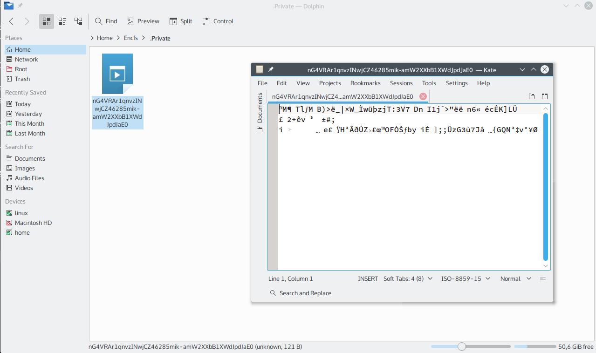

#Diretórios criptografados no Linux

Está trabalhando naquele "super projeto" e anda preocupado com a segurança dos seus dados?

Faz todo sentido, afinal, a grande maioria dos desenvolvedores trabalha em um notebook.

Sexta-feira, voltando para casa, carro parado no semáforo e pimba! Perdeu, playboy! 
Além do incoveniente de perder os dados (podemos falar de estratégias de backup outro dia), imagina todo o seu código simplesmente "passeando" por aí?

Para evitar (ou pelo menos dificultar bastante) o acesso aos seus dados no HD, uma boa saída é criptografar seus dados.

No Mac OS X basta ativar o [FileVault](https://support.apple.com/pt-br/HT204837). No Windows também é fácil, ś só ligar o [Bitlocker](http://windows.microsoft.com/pt-br/windows-8/bitlocker-drive-encryption). No Linux também é fácil: com um clique, durante a instalação do Ubuntu, Debian, Fedora, OpenSuSE e muitas outras distribuições, é possível ativar a criptografia no diretório `/home` ou até mesmo no disco todo.

Mas e se seu Linux já está instalado e você não usou criptografia? E se você quer criptografia apenas para uma pasta específica?
O Linux utiliza o LUKS como padrão para criptografia de disco. Através do módulo DM-Crypt, incluso no Kernel, e dos utilitários CryptSetup, é possível configurar uma infinidade de cenários. O problema é que estes programas são complicados, a documentação não é tão clara e amigável, e problemas na configuração podem fazer a máquina parar de inicializar, sendo necessário reformatar o computador. Assustador, não é?

Vamos mostrar hoje uma solução alternativa usando o [eCryptFS](http://ecryptfs.org/about.html) e o [EncFS](https://github.com/vgough/encfs). O eCryptFS é uma solução opensource e é utilizado como base para o sistema de criptografia de pasta de usuário no Ubuntu Linux e também no Google Chrome OS. O EncFS utiliza as capacidades de criptografia do eCryptFS para criar um filesystem criptografado acessível via FUSE.

Como queremos facilidade, incluiremos uma ferramenta gráfica para gerenciar nossa pasta segura.

Vamos começar? Estou utilizando um Debian Jessie, mas os processos mostrados aqui são parecidos no Ubuntu e outras distros baseadas em Debian. Para outras distros, procure no seu gerenciador de pacotes.

O primeiro passo é instalar os aplicativos necessários:

```
$ sudo apt-get install -y encfs ecryptfs-utils
Reading package lists... Done
Building dependency tree       
...
```

Já instalamos os aplicativos que fazem a parte pesada, vamos agora instalar a interface gráfica de gerenciamento.
No Debian/Ubuntu, digite o comando abaixo para adicionar o repositório e instalar o software:
```
$ sudo add-apt-repository ppa:gencfsm
$ sudo apt-get update
$ sudo apt-get -y install gnome-encfs-manager
```

Pacotes para outras distros podem ser encontrados 
[aqui.](http://software.opensuse.org/download.html?project=home:moritzmolch:gencfsm&package=gnome-encfs-manager)

Isso é tudo que precisamos para criar a pasta segura.
Procure na sua lista de aplicativos pelo Gnome EncFS Manager:


Ao executar o programa, um ícone (um desenho de uma pasta com uma chave dentro) aparece na área de notificação:


Se a janela principal do aplicativo não for exibida, clique no ícone e selecione a opção **Show Manager**.
Esta é a aparência do programa:


Antes de criar a pasta segura, vamos entender como o app funciona.
O EncFS cria uma pasta onde os arquivos criptografados são armazenados. 
Esta pasta está sempre disponível, mas nunca iremos acessá-la diretamente.
Ao abrir o programa, sua senha será solicitada e todos os arquivos aparecerão descriptografados na sua pasta de projeto.
Por isso, criar a pasta criptografada com um ponto no início do nome é uma boa ideia, assim ela fica oculta e evitamos acessá-la.

Clique no **+**. Na janela seguinte, o programa oferece algumas opções que podem ser utilizadas sem medo: 
um diretório `$HOME/Encfs/` será criado com duas subpastas, uma visível (`Private/`), onde você colocará seus projetos e que chamaremos de pasta protegida, e outra invisível (`.Private/`), usada internamente pelo programa para colocar os arquivos criptografados, que chamaremos de pasta criptografada.

Aceite as opções default do programa, escolha uma senha forte - lembre-se de não anotá-la em um post-it colado na sua tela - e clique em create:


Pronto! Já temos a pasta configurada. Na janela principal ela aparece como "montada":


**Nota:** Se você já tem uma pasta de projetos, não selecione-a como ponto de montagem para a pasta protegida. Você deve criar a pasta protegida em um novo local e mover seus arquivos para dentro dela após criada e montada.

Com isso encerramos a configuração da nossa pasta protegida. Porém, se você (assim como eu) é curioso, vai querer saber como as coisas funcionam por baixo do capô.
Para ver como o EncFS trata os arquivos, vou entrar na pasta protegida e crier um novo arquivo de texto:


Agora, através do gerenciador, vou desmontar a pasta protegida e tentar acessar os arquivos na pasta criptografada.
Basta desmarcar a opção "mounted":


E tentar acessar a pasta `.Private/` ao invés da `Private/`:



Maravilha! Tanto o nome do arquivo quanto seu conteúdo estão criptografados e protegidos dos terríveis hackers ladrões de HDs.

É isso, pessoal. 
Agora é só lembrar de montar a sua pasta na inicialização do PC (isso não pode ser automatizado porque requer a sua senha) e colocar seus arquivos importantes lá dentro.
Tire um tempo para ler a página de FAQ do [Gnome EncFS Manager](https://answers.launchpad.net/gencfsm).
Aproveite nosso blog para postar suas dúvidas.
Até a próxima!


