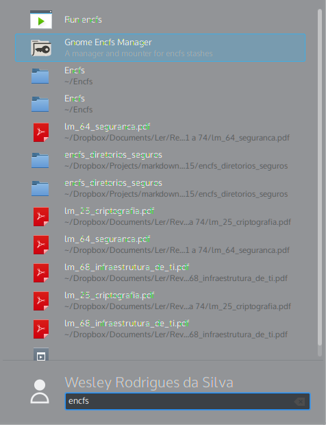

Está trabalhando naquele "super projeto" e anda preocupado com a segurança dos seus dados?

Faz todo sentido, afinal, a grande maioria dos desenvolvedores trabalha em um notebook.

Sexta-feira, voltando para casa, carro parado no semáforo e pimba! Perdeu, playboy! 
Além do incoveniente de perder os dados (podemos falar de estratégias de backup outro dia), imagina todo o seu código simplesmente "passeando" por aí?

Para evitar (ou pelo menos dificultar bastante) o acesso aos seus dados no HD, uma boa saída é criptografar seus dados.

No Mac OS X basta ativar o [FileVault](https://support.apple.com/pt-br/HT204837). No Windows também é fácil, ś só ligar o [Bitlocker](http://windows.microsoft.com/pt-br/windows-8/bitlocker-drive-encryption). No Linux também é fácil: com um clique, durante a instalação do Ubuntu, Debian, Fedora, OpenSuSE e muitas outras distribuições, é possível ativar a criptografia no diretório `/home` ou até mesmo no disco todo.

Mas e se seu Linux já está instalado e você não usou criptografia? E se você quer criptografia apenas para uma pasta específica?
O Linux utiliza o LUKS como padrão para criptografia de disco. Através do módulo DM-Crypt, incluso no Kernel, e dos utilitários CryptSetup, é possível configurar uma infinidade de cenários. O problema é que estes programas são complicados, a documentação não é tão clara e amigável, e problemas na configuração podem fazer a máquina parar de inicializar, sendo necessário reformatar o computador. Assustador, não é?

Vamos mostrar hoje uma solução alternativa usando o [eCryptFS](http://ecryptfs.org/about.html) e o [EncFS](https://github.com/vgough/encfs). O eCryptFS é uma solução opensource e é utilizado como base para o sistema de criptografia de pasta de usuário no Ubuntu Linux e também no Google Chrome OS. O EncFS utiliza as capacidades de criptografia do eCryptFS para criar um filesystem criptografado acessível via FUSE.

Como queremos facilidade, incluiremos uma ferramenta gráfica para gerenciar nossa pasta segura.

Vamos começar? Estou utilizando um Debian Jessie, mas os processos mostrados aqui são parecidos no Ubuntu e outras distros baseadas em Debian. Para outras distros, procure no seu gerenciador de pacotes.

O primeiro passo é instalar os aplicativos necessários:

```
$ sudo apt-get install -y encfs ecryptfs-utils
Reading package lists... Done
Building dependency tree       
...
```

Já instalamos os aplicativos que fazem a parte pesada, vamos agora instalar a interface gráfica de gerenciamento.
No Debian/Ubuntu, digite o comando abaixo para adicionar o repositório e instalar o software:
```
$ sudo add-apt-repository ppa:gencfsm
$ sudo apt-get update
$ sudo apt-get -y install gnome-encfs-manager
```

Pacotes para outras distros podem ser encontrados 
[aqui.](http://software.opensuse.org/download.html?project=home:moritzmolch:gencfsm&package=gnome-encfs-manager)

Isso é tudo que precisamos para criar a pasta segura.
Procure na sua lista de aplicativos pelo Gnome EncFS Manager




