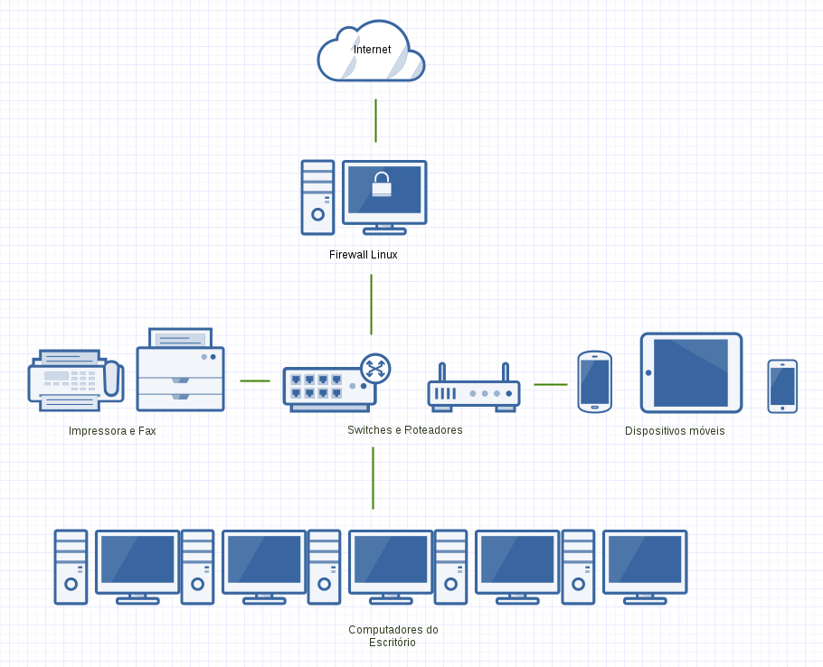

<!---
Local Variables:
ispell-local-dictionary: "brasileiro"
End:
-->

Segurança em redes wireless
===========================

Nos últimos 15 anos passamos a utilizar com mais frequência a 
Internet como ferramenta para atividades cotidianas, como pagar contas,
nos comunicar ou comprar produtos.
Sempre nos disseram que era uma boa prática ter o "cadeado"
na janela do navegador, indicando uma conexão HTTPS.

 

Só que a evolução não parou aí: os desktops foram quase que totalmente
substituídos pelos smartphones e tablets em tarefas de comunicação.
Um problema existente nessa nova abordagem é que fica mais difícil 
saber como o aplicativo foi implementado, se ele utiliza realmente
algum tipo de criptografia e boas práticas de segurança.

Quando o app não usa HTTPS (ou alguma outra forma de comunicação segura)
é relativamente fácil para outras pessoas com acesso à rede onde seu
telefone está conectado interceptarem o tráfego.

Vejamos como.

Cenário Fictício
----------------
Vamos imaginar uma empresa fictícia, um escritório de 
contabilidade com cerca de 100 funcionários. Como a maioria
das empresas deste porte, há uma sala com equipamentos de
informática e um analista responsável pelo suporte.

O analista mantém um desenho da rede para facilitar a administração:

 

Como muitas empresas deste porte, nossa empresa de exemplo 
mantém um firewall caseiro muito rudimentar,
composto por uma boa máquina com várias placas de rede e 
executando uma distro GNU/Linux com IPTables e Squid.
Como o Linux é o Gateway padrão da rede, todo o tráfego que vai para 
a Internet acaba passando por ele. 

É cada vez mais comum encontrarmos empresas que 
fornecem uma conexão wireless, já que os planos de dados 
do Brasil não são nenhuma maravilha. Neste caso não
é diferente.

Todos os dispositivos que se conectam em uma rede doméstica recebem
um número IP para identificação e diferenciação dos outros.

Certo. Munidos de todas estas informações, o que será que
um analista de TI com acesso ao firewall da rede consegue fazer?

Sniffing com TCP Dump
---------------------
Com um celular conectado à rede wireless, o primeiro passo é descobrir seu
IP. Quando temos um servidor Linux rodando DHCP, essa é uma tarefa simples.
Basta olhar o arquivo de **leases**:
[ imagem dos leases ]

Agora que já sabemos, utilizaremos o comando `tcpdump`, que captura
todo o tráfego que passa pelo servidor. Para não gerar muito 
tráfego, utilizaremos o IP do celular como filtro:

`[root@TheServer ~]# tcpdump -i any -s 65535 -w espiadinha.pcap`

Enquanto a sequência `CTRL+C` não for pressionada, todo o tráfico
com origem ou destino a este telefone será copiado também para
o arquivo `espiadinha.pcap`.

Sabe o que é mais assustador? O usuário não percebe nada!

OK, mas qual o conteúdo deste arquivo? A resposta é DEPENDE.
Se o aplicativo executado durante a captura utilizou criptografia,
então o conteúdo será ilegível (ao menos para pobres mortais sem 
os conhecimentos dos hackers). Vejamos como fica o arquivo quando
utilizamos o Facebook:
[ imagem do tcpdump do facebook ]

Entretanto, se o aplicativo foi feito sem as melhores práticas de 
segurança, olha o resultado:
[ imagem de algum app sem criptografia ]

:O

Análise com Wireshark
---------------------

Olhar os dumps no modo texto pode ser um pouco chato.
Existe uma ferramenta chamada Wireshark que pode tornar
esta tarefa mais simples.

É muito simples: o John Armless acessa o servidor via SSH e dispara um 
comando para capturar uma série de arquivos de vários celulares dos
funcionários. No final do expediente, ele copia todos os arquivos e 
leva para casa. Em casa ele instala o Wireshark em seu PC e abre os
arquivos `.pcap`. Olha que bonito:
[ imagem de um wireshark com um dump ]

Como se proteger?
-----------------

É bem difícil. Não tem como o usuário saber se o aplicativo utiliza ou não
HTTPS. Diferentemente dos sites, que exibem o protocolo na barra de 
endereços do navegador, um aplicativo pode ocultar todos os detalhes
de sua implementação. Por isso é importante utilizar aplicativos
de fornecedores confiáveis, evitando digitar dados sigilosos em 
apps feitos por empresas desconhecidas ou instalados de fontes 
estranhas. Prefira apps das lojas oficiais, como Google Play e 
Apple Store, e não coloque informações como número de documento ou
cartão de crédito em aplicativos pouco conhecidos.
É isso aí. Já foi espiado por algum John Armless? Já desconfiou que
alguma rede onde estava não era segura? Deixe seu relato nos
comentários. Abraço e até a próxima!
